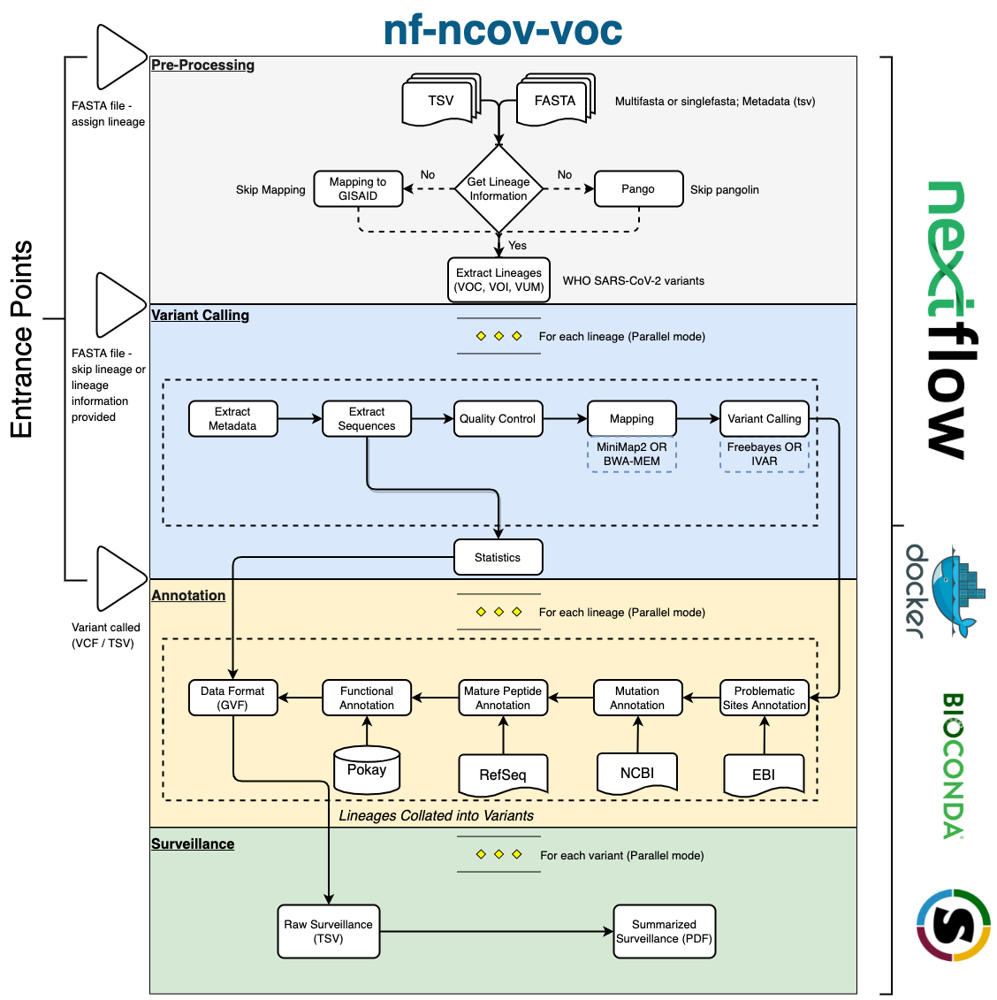

# nf-ncov-voc

[](https://www.nextflow.io/)
[](https://docs.conda.io/en/latest/)
[](https://www.docker.com/)
[](https://sylabs.io/docs/)


## Introduction

**nf-ncov-voc** is a bioinformatics analysis workflow used for 
performing variant calling on SARS-CoV-2 genomes to identify and 
profile mutations in Variants of Concern (VOCs), Variants of 
Interest (VOIs) and Variants under Monitoring (VUMs). This workflow has 
four main stages - **Preprocessing**, **Genomic Analysis (Variant 
Calling)** , **Functional Annotation** and **Surveillance**. 
**nf-ncov-voc** workflow can be used in combination with an interactive 
visualization tool [COVID-MVP](https://github.com/cidgoh/COVID-MVP) 
or as a stand-alone high-throughput analysis tool to produce 
mutation profiles and surveillance reports. 

As an input, **nf-ncov-voc** workflow requires SARS-CoV-2 consensus 
sequences in `FASTA` format and Metadata file in `TSV` format. 
Sequences in pre-processing stage are filtered using Metadata 
variables, quality filtered and assigned lineages. Sequences 
assigned as VOCs, VOIs and VUMs are then mapped to SARS-CoV-2 genome,
variant called and normalized in Genomic Analysis (Variant Calling) 
module. Mutations called are then annotated in several stages 
including flagging the potential contaminated sites, mutation 
annotation, genomic feature annotation, mature peptide annotation 
and finally respective biological functional impact using the 
manually curated effort [Pokay](https://github.com/nodrogluap/pokay).
(lead by Paul Gordon [@nodrogluap](https://github.com/nodrogluap)). 
Finally, in the surveillance module, these functional profiles are 
summarized using functional indicators to highlight key functions 
and mutations responsible for them for e.g. **P618H** role in 
_convalescent plasma escape_.

The workflow is built using [Nextflow](https://www.nextflow.io)-
[DSL2](https://www.nextflow.io/docs/latest/dsl2.html), a workflow 
tool to run tasks across multiple compute infrastructures in a very 
portable manner. It can use `conda`/`Docker`/`Singularity` 
containers making installation trivial and results highly reproducible.

A detailed structure and each module of the workflow is presented 
below in the dataflow diagram 
### nf-ncov-voc Dataflow




### Pre-Processing

This module offers two ways to get lineage information for each 
genome in `FASTA` file and listed respectively in Metadata file 
unless a column `pango_lineage` is already available in which case 
both options can be skipped. First option is to use 
[PANGOLIN](https://github.com/cov-lineages/pangolin) to assign 
lineages and merge the metadata with pangolin report. This 
step can be skipped by passing `--skip_pangolin`. The second option 
is to map input metadata to [GISAID](https://www.gisaid.org) metadata 
file (which can be provided by `--gisaid_metadata` parameter) if the 
genomes are available in GISAID. This option is faster and 
computationally less expensive, though limits to only genomes 
available in GISAID. This option can be skipped by 
using `--skip_mapping`.

### Genomic Analysis
This module currently supports two different modes - "_reference_" & 
"_user_" which can be passed with `--mode reference` or `--mode 
user`. By default, `--mode reference` is activated which allows you 
to build a reference library for each lineage and subsequently each 
variant for comparative analysis. This mode can take `FASTA` file 
with multiple genomes (**recommended** & **default**) or single 
genome with a metadata file that should have one column atleast 
(`pango_lineage`) as minimal metadata 
(see [Workflow Summary](#workflow-summary) for detailed options). 
The user mode (`--mode user`) is by defaultactive when using 
interactive visualization through 
[COVID-MVP](https://github.com/cidgoh/COVID-MVP) where a user can 
upload `GVF` file for comparative analysis against the reference data. 
Uploaded dataset can be a `FASTA` file or variant called `VCF` file.

### Functional Annotation

In this module, the variant called `VCF` file for each lineage is 
converted into a `GVF` (Genomic Variant Format) file and annotated 
with functional information using 
[Pokay](https://github.com/nodrogluap/pokay). GVF is a variant of 
GFF3 format that is standardized for describing genomic mutations; 
it is used here because it can describe mutations across multiple 
rows, and because the "#attributes" column can store information in 
custom key-value pairs. The key-value pairs added at this stage 
include for each mutation: VOC/VOI status, clade-defining status 
(for reference lineages), and functional annotations parsed using 
[vcf2gvf.py](https://github.com/cidgoh/nf-ncov-voc/blob/master/bin/vcf2gvf.py) 
file written in python.

### Surveillance Reports

Different `GVF` files for the same variant are then collated and 
summarized into a `TSV` file that contains mutation prevalence, 
profile and functional impact. Further `TSV` file is also summarized 
as a more human friendly and impactful surveillance report in a 
`PDF` format. Relevant/important indicators can be specified in the 
[tsv file](https://github.com/cidgoh/nf-ncov-voc/blob/master/assets/ncov_surveillanceIndicators/functions_df_template.tsv). This 
This feature can be used to identify and tracktransmission trends in 
a dataset, aid detection of new cluster important mutations with 
severe impact based on the datasets used.

## Workflow Summary

The workflow has numerous options to allow you to run workflow with 
modes and alternate options for major step if you so wish. For 
example, in `mode --reference` user can use `BWAMEM` using `--bwa` 
instead of `MINIMAP2` (*default*) for mapping consensus sequences to 
reference genome. Similarly, `ivar` with parameter `--ivar` for 
variant calling instead of `freebayes` (*default*) option.

See the 
[parameters](https://github.com/cidgoh/nf-ncov-voc/blob/master/docs/PARAMETERS.md) 
docs for all available options when running the workflow.

### Reference Mode

* _Data Extraction & Quality Control_
    1.  Metadata extraction ([`bin/extract_metadata.py`](https://github.com/cidgoh/nf-ncov-voc/blob/master/bin/extract_metadata.py) && [`modules/custom.nf/extractMetadata`](https://github.com/cidgoh/nf-ncov-voc/blob/master/modules/custom.nf))
    2.  Sequence extraction ([`SEQKIT`](https://github.com/shenwei356/seqkit))
    3.  Consensus QC ([`BBMAP`](https://jgi.doe.gov/data-and-tools/bbtools/bb-tools-user-guide/bbmap-guide/))
* _Variant Calling_
    1.  Mapping ([`Minimap2`](https://github.com/lh3/minimap2); *default* [`BWA`](https://github.com/lh3/bwa); *optional* )
    2.  Sort and index alignments ([`SAMtools`](https://sourceforge.net/projects/samtools/files/samtools/))
    3.  Choice of multiple variant calling routes: [`Freebayes`](https://github.com/freebayes/freebayes) *default & recommended*; [`iVar variants`](https://github.com/andersen-lab/ivar); *optional*)
* _Post-Processing_
    1.  Filtering Problematic sites ([`problematic_sites_tag.py`](https://github.com/cidgoh/nf-ncov-voc/blob/master/bin/problematic_sites_tag.py) using [ProblematicSites_SARS-CoV-2](https://github.com/W-L/ProblematicSites_SARS-CoV2))
    2.  Variant annotation ([`SnpEff`](http://snpeff.sourceforge.net/SnpEff.html))
    3.  Peptide annotation ([`mature_peptide_annotation.py`](https://github.com/cidgoh/nf-ncov-voc/blob/master/bin/mature_peptide_annotation.py))
    4.  Functional Annotation ([`vcf2gvf.py`](https://github.com/cidgoh/nf-ncov-voc/blob/master/bin/vcf2gvf.py))
    5.  Surveillance Report ([`gvf2tsv.py`](https://github.com/cidgoh/nf-ncov-voc/blob/master/bin/gvf2tsv.py))
    

## Usage

1. Install [`Nextflow`](https://www.nextflow.io/docs/latest/getstarted.html#installation) (`>=21.04.0`)

2. Install any of [`Docker`](https://docs.docker.com/engine/installation/), [`Singularity`](https://www.sylabs.io/guides/3.0/user-guide/) or [`Conda`](https://conda.io/miniconda.html) for full pipeline reproducibility _see [recipes](https://github.com/cidgoh/nf-ncov-voc/tree/master/environments)_

3. Download the pipeline and run with help for detailed parameter options:

    ```bash
    nextflow run nf-ncov-voc/main.nf --help
    ```

    ```bash
    N E X T F L O W  ~  version 21.04.3
    Launching `main.nf` [berserk_austin] - revision: 93ccc86071

    Usage:
      nextflow run main.nf -profile [singularity | docker | conda) --prefix [prefix] --mode [reference | user]  [workflow-options]

    Description:
      Variant Calling workflow for SARS-CoV-2 Variant of Concern (VOC) and Variant of Interest (VOI) consensus sequences to generate data for Visualization
      All options set via CLI can be set in conf directory

    Nextflow arguments (single DASH):
      -profile                  Allowed values: conda & singularity

    Mandatory workflow arguments (mutually exclusive):
      --prefix                  A (unique) string prefix for output directory for each run.
      --mode                    A flag for user uploaded data through visualization app or high-throughput analyses (reference | user) (Default: reference)

    Optional:
      --variants                Provide a variants file (tsv) (Default: /Users/au572806/GitHub/nf-ncov-voc/.github/data/variants/variants_who.tsv)
      --input_type              Specify type of input file (vcf | tsv | fasta) (Default: vcf)
      --gisaid                  Specify if the dataset is from GISAID (gisaid) (Default: None)
      --single-genome           Specify if the dataset is single genome (single-genome) (Default: None)
      --userfile                Specify userfile (fasta | tsv | vcf) (Default: None)
      --outdir                  Output directory (Default: /Users/au572806/GitHub/nf-ncov-voc/results)
      --ivar                    Run the ivar workflow (Default: false, use freebayes workflow)
      --startdate               Start date (Submission date) to extract dataset (yyyy-mm-dd) (Default: "None")
      --enddate                 Start date (Submission date) to extract dataset (yyyy-mm-dd) (Default: "None")
      --ref                     Path to SARS-CoV-2 reference fasta file (Default: /Users/au572806/GitHub/nf-ncov-voc/.github/data/refdb)
      --bwa                     Use BWA for mapping reads (Default: false, use Minimap2)
      --bwa_index               Path to BWA index files (Default: /Users/au572806/GitHub/nf-ncov-voc/.github/data/refdb)
      --gff                     Path to annotation gff for variant consequence calling and typing. (Default: /Users/au572806/GitHub/nf-ncov-voc/.github/data/features)
      --mpileupDepth            Mpileup depth (Default: unlimited)
      --var_FreqThreshold       Variant Calling frequency threshold for consensus variant (Default: 0.75)
      --var_MinDepth            Minimum coverage depth to call variant (ivar variants -m, freebayes -u Default: 10)
      --var_MinFreqThreshold    Minimum frequency threshold to call variant (ivar variants -t, Default: 0.25)
      --varMinVariantQuality    Minimum mapQ to call variant (ivar variants -q, Default: 20)
    ```

4. Start running your own analysis!

    * Typical command for reference mode with GISAID dataset from specific dates :

        ```bash
        nextflow nf-ncov-voc/main.nf \
            -profile <conda | singularity | docker> \
            --prefix testing \
            --mode reference \
            --gisaid \
            --startdate 2020-01-01 \
            --enddate 2020-01-01\
            --outdir results
        ```

    * Typical command for reference mode with non-GISAID dataset:

        ```bash
        nextflow nf-ncov-voc/main.nf \
            -profile <conda | singularity | docker> \
            --prefix testing \
            --mode reference \
            --outdir results
        ```

    * An executable Python script called [`functional_annotation.py`](https://github.com/cidgoh/nf-ncov-voc/blob/master/bin/functional_annotation.py) has been provided if you would like to update the functional annotations from `POKAY`. This will create a new file which **should replace** the file in [.github/data/functional_annotation](https://github.com/cidgoh/nf-ncov-voc/blob/master/.github/data/functional_annotation).


## Acknowledgments

This workflow and scripts are written and conceptually designed by
| Name                                                      | Affiliation                                                                           |
|-----------------------------------------------------------|---------------------------------------------------------------------------------------|
| Zohaib Anwar; [@anwarMZ](https://github.com/anwarMZ)               | [Centre for Infectious Disease Genomics and One Health, Simon Fraser University, Canada](https://cidgoh.ca)                           |
| Madeline Iseminger; [@miseminger](https://github.com/miseminger)         | [Centre for Infectious Disease Genomics and One Health, Simon Fraser University, Canada](https://cidgoh.ca)                 |
| Anoosha Sehar; [@Anoosha-Sehar](https://github.com/Anoosha-Sehar)              | [Centre for Infectious Disease Genomics and One Health, Simon Fraser University, Canada](https://cidgoh.ca)                            |
| Ivan Gill; [@ivansg44](https://github.com/ivansg44)                       | [Centre for Infectious Disease Genomics and One Health, Simon Fraser University, Canada](https://cidgoh.ca)                 |
| William Hsiao; [@wwhsiao](https://github.com/wwhsiao)              | [Centre for Infectious Disease Genomics and One Health, Simon Fraser University, Canada](https://cidgoh.ca)                         |
| Paul Gordon; [@nodrogluap](https://github.com/nodrogluap)                | [CSM Center for Health Genomics and Informatics, University of Calgary, Canada](http://www.ucalgary.ca/~gordonp)                         |
| Gary Van Domselaar; [@phac-nml](https://github.com/phac-nml)                | [Public Health Agency of Canada](https://umanitoba.ca/faculties/health_sciences/medicine/units/medical_microbiology/faculty/vandomselaar.html)                         |

Many thanks to others who have helped out and contributed along the way too, including (but not limited to)\*: [Canadian COVID Genomics Network - VirusSeq, Data Analytics Working Group](https://virusseq.ca/about/governance/)

## Contributions and Support

If you would like to contribute to this pipeline, please see the [contributing guidelines](.github/CONTRIBUTING.md).
For further information or help, don't hesitate to get in touch at <mzanwar@sfu.ca> or <wwhsiao@sfu.ca>

## Citations
An extensive list of references for the tools used by the workflow can be found in the [`CITATIONS.md`](CITATIONS.md) file.
