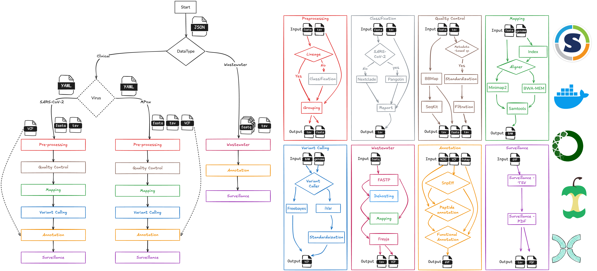

# nf-ncov-voc

[](https://www.nextflow.io/)
[](https://docs.conda.io/en/latest/)
[](https://www.docker.com/)
[](https://sylabs.io/docs/)

## Introduction

**nf-ncov-voc** is a bioinformatics workflow developed to process viral genomes and integrate the contextual data.
The workflow was intially designed for processing SARS-CoV-2 for COVID-19 pandemic response and has been later adapted for Mpox. Two different versions for RSV and Influenza are in actvie development. The workflow is developed in a modular structure with several modules and sub-workflows leveraged from [nf-core](https://nf-co.re). These modules and sub-workflows are assembled in a plug-n-play manner based on the data and viral charatceristics. Each virus supported by the workflow has its own workflow file that directs the assembly of sub-workflows and modules.

The workflow is built using [Nextflow](https://www.nextflow.io)- [DSL2](https://www.nextflow.io/docs/latest/dsl2.html), a workflow tool to run tasks across multiple compute infrastructures in a very portable manner. It can use `conda`/`Docker`/`Singularity` containers making installation trivial and results highly reproducible.

**nf-ncov-voc** workflow can be used in combination with an interactive
visualization tool [VIRUS-MVP](https://github.com/cidgoh/VIRUS-MVP) or as a stand-alone high-throughput analysis tool to produce mutation profiles and surveillance reports.

A detailed structure and each module of the workflow is presented
below in the dataflow diagram

### nf-ncov-voc Dataflow



### Modes

The workflow can be run in three different modes (`--mode reference`, `--mode user`, or `--wastewater`).

- **Reference Mode**: This is the default and most commonly used mode. In this mode, input data is processed in bulk, and the resulting files can be viewed in the VIRUS-MVP visualization tool. This mode enables the most flexibility and features such as grouping data by different variables. User mode currently only supports uploading a FASTA file.
- **User Mode**: This mode is designed for an enhanced user experience. The workflow is containerized and integrated directly into the visualization tool, allowing users to upload a FASTA file. The uploaded file is processed and viewed along with other groups in the visualization. This mode is suitable for teams setting up their own instances for regular surveillance.
- **Wastewater Mode**: This mode is specified by passing the parameter `--wastewater`. It is used for processing wastewater samples sequenced using FASTQ reads.

Each mode tailors the workflow to different use cases, ensuring flexibility and adaptability for various analysis needs.

### Input data

As an input, **nf-ncov-voc** can accept different formats, Whole Genome Sequences (WGS) in `FASTA` format with a Metadata file in `TSV` format; paired-end short read sequences in `FASTQ` format with a Metadata file in `TSV` format. Additionally, the input can also be `VCF` file that contains variants called.

### Classification

This module offers a classification subworkflow that can be used for classifying sequences into lineages or clades using either [pangolin](https://github.com/cov-lineages/pangolin) (SARS-CoV-2 specific) or [Nextclade](https://clades.nextstrain.org) (SARS-CoV-2 & Mpox). The output report from these classification tools is merged with the metadata file before further processing. If a column `pango_lineage` is already available in the metadata file, this step can be skipped. To skip this step, use the `--skip_classification` parameter.

### Grouping data

**nf-ncov-voc** allows for flexible grouping of input data to facilitate comparative analysis. Grouping can be based on various metadata attributes such as collection date, geographic location, or lineage information. This is particularly useful for identifying patterns and trends within specific subsets of the data. Users can specify grouping criteria through the `--grouping_criteria` parameter, which accepts a metadata column. For example, to group data by lineage you would use `--grouping_criteria lineage` or `--grouping_criteria time` for time based grouping. This feature enables targeted analysis and more meaningful interpretation of results by focusing on relevant data subsets.

### Quality control

**nf-ncov-voc** employs different tools for quality control based on the input data format. When the input is in `FASTA` format, the workflow uses `BBMAP` to remove sequences containing a specified number of `Ns` representing missing data. This ensures that only high-quality sequences are processed further. Users can customize the maximum number of `Ns` allowed in the sequences through the `--maxns` parameter.

For `FASTQ` format inputs, typically used for wastewater samples, the workflow utilizes `fastp` to filter out low-quality sequences. `fastp` performs comprehensive quality control, including trimming low-quality bases and filtering out reads that do not meet the quality thresholds. Users can customize various options in `fastp` to suit their specific requirements.

Both tools provide flexibility and customization options to ensure that the quality control process meets the needs of different datasets and analysis goals.

### Variant Calling

In the variant calling stage, the workflow supports two main options for input sequences in `FASTA` format: `iVar` and `Freebayes`. Users can choose between these tools based on their specific requirements. The `iVar` tool is used for more stringent variant calling, while `Freebayes` offers a more flexible approach.

For wastewater samples, the workflow employs the [`Freyja`](https://github.com/andersen-lab/Freyja) subworkflow, which is specifically designed to handle the complexities associated with wastewater sequencing data. This subworkflow ensures accurate variant calling and analysis for wastewater samples.

### Functional Annotation

**nf-ncov-voc** offers a unique opportunity to integrate contextual data with genomics data. Mutations identified through variant calling are annotated in several stages, including flagging potential contaminated sites, mutation annotation, genomic feature annotation, mature peptide annotation, and assessing the biological functional impact using the manually curated effort Pokay. For more information on how the functions are curated and structured, see the dedicated repository [_Pokay_](https://github.com/nodrogluap/pokay).

The `Variant Called File (VCF)` generated for each group or sample is converted to a `Genome Variant File (GVF)` to integrate the functions associated with different mutations. GVF is a variant of the GFF3 format standardized for describing genomic mutations; it is used here because it can describe mutations across multiple rows, and the "#attributes" column can store information in custom key-value pairs. The key-value pairs added at this stage include, for each mutation: VOC/VOI status, clade-defining status (for reference lineages), and functional annotations.

#### Mutation Functional Annotation Contextual Data Specifications

To facilitate the integration of external annotations, we have developed a [Pathogen-Mutation-Functional-Annotation-Package](https://github.com/cidgoh/pathogen-mutation-functionalannotation-package). Users can use this template to add functional information using a controlled vocabulary and pick lists and integrate them into their analyses. To validate user-developed annotations, we have developed a [DataHarmonizer](https://github.com/cidgoh/DataHarmonizer) template for VIRUS-MVP functional annotation. This harmonization process enhances data quality and creates interoperability between different systems, facilitating collaborative research efforts and cross-study comparisons.

### Surveillance Reports

**nf-ncov-voc**, with the help of functional data, produces surveillance reports developed in collaboration with Public Health partners. These reports offer a high-level yet comprehensive overview of each mutation and its associated functions in the literature. For each group, the `GVF` file is used to produce two kinds of surveillance reports. The first is in `TSV` format, which aims to help integration with other surveillance tools. The second is a summarized `PDF` format, which aims to assist partners, collaborators, and end-users in regular genomic surveillance. These reports contain mutation prevalence, profile, and functional impact. Relevant/important indicators can be specified in the [tsv file](https://github.com/cidgoh/nf-ncov-voc/blob/master/assets/ncov_surveillanceIndicators/functions_df_template.tsv). This feature of surveillance reports can be used to identify new clusters, important mutations, and track their transmission and prevalence trends. However, if not required, this step can be skipped using `--skip_surveillance`. An example of a surveillance file for the Omicron variant using the [VirusSeq Data Portal](https://virusseq-dataportal.ca) is available in [Docs](https://github.com/cidgoh/nf-ncov-voc/blob/master/docs).

** Further developments will continue to adapt nf-ncov-voc to other viruses in near furture. **

## Usage

1. Install [`Nextflow`](https://www.nextflow.io/docs/latest/getstarted.html#installation) (`>=21.04.0`)

2. Install any of [`Docker`](https://docs.docker.com/engine/installation/), [`Singularity`](https://www.sylabs.io/guides/3.0/user-guide/) or [`Conda`](https://conda.io/miniconda.html) for full pipeline reproducibility _see [recipes](https://github.com/cidgoh/nf-ncov-voc/tree/master/environments)_

3. Download the pipeline and run with help for detailed parameter options:

   ```bash
   nextflow run nf-ncov-voc/main.nf --help
   ```

   See the
   [parameters](https://github.com/cidgoh/nf-ncov-voc/blob/master/docs/PARAMETERS.md)
   docs for all available options when running the workflow.

   ```bash
   N E X T F L O W  ~  version 21.04.3
   Launching `main.nf` [berserk_austin] - revision: 93ccc86071

   Usage:
    nextflow run main.nf -profile [singularity | docker | conda) --prefix [prefix] --mode [reference | user]  [workflow-options]

   Description:
    Variant Calling workflow for SARS-CoV-2 Variant of Concern (VOC) and
    Variant of Interest (VOI) consensus sequences to generate data
    for Visualization. All options set via CLI can be set in conf
    directory

   Nextflow arguments (single DASH):
    -profile                  Allowed values: conda & singularity

   Mandatory workflow arguments (mutually exclusive):
    --prefix                  A (unique) string prefix for output directory for each run.
    --mode                    A flag for user uploaded data through visualization app or
                              high-throughput analyses (reference | user) (Default: reference)

   Optional:

   Input options:
    --seq                     Input SARS-CoV-2 genomes or consensus sequences
                              (.fasta file)
    --meta                    Input Metadata file of SARS-CoV-2 genomes or consensus sequences
                              (.tsv file)
    --userfile                Specify userfile
                              (fasta | vcf) (Default: None)
    --gisaid_metadata         If lineage assignment is preferred by mapping metadata to GISAID
                              metadata file, provide the metadata file (.tsv file)
    --variants                Provide a variants file
                              (.tsv) (Default: /Users/au572806/GitHub/nf-ncov-voc/assets/ncov_variants/variants_who.tsv)
    --outdir                  Output directory
                              (Default: /Users/au572806/GitHub/nf-ncov-voc/results)
    --gff                     Path to annotation gff for variant consequence calling and typing.
                              (Default: /Users/au572806/GitHub/nf-ncov-voc/assets/ncov_genomeFeatures/MN908947.3.gff3)
    --ref                     Path to SARS-CoV-2 reference fasta file
                              (Default: /Users/au572806/GitHub/nf-ncov-voc/assets/ncov_refdb/*)
    --bwa_index               Path to BWA index files
                              (Default: /Users/au572806/GitHub/nf-ncov-voc/assets/ncov_refdb/*)

   Selection options:

    --ivar                    Run the iVar workflow instead of Freebayes(default)
    --bwamem                  Run the BWA workflow instead of MiniMap2(default)
    --skip_pangolin           Skip PANGOLIN. Can be used if metadata already have lineage
                              information or mapping is preferred method
    --skip_mapping            Skip Mapping. Can be used if metadata already have lineage
                              information or PANGOLIN is preferred method

   Preprocessing options:
    --startdate               Start date (Submission date) to extract dataset
                              (yyyy-mm-dd) (Default: "2020-01-01")
    --enddate                 Start date (Submission date) to extract dataset
                              (yyyy-mm-dd) (Default: "2022-12-31")

   Genomic Analysis parameters:

    BBMAP
    --maxns                   Max number of Ns allowed in the sequence in qc process
    --minlength               Minimun length of sequence required for sequences
                              to pass qc filtration. Sequence less than minlength
                              are not taken further

    IVAR/FREEBAYES
    --ploidy                  Ploidy (Default: 1)
    --mpileupDepth            Mpileup depth (Default: unlimited)
    --var_FreqThreshold       Variant Calling frequency threshold for consensus variant
                              (Default: 0.75)
    --var_MaxDepth            Maximum reads per input file depth to call variant
                              (mpileup -d, Default: 0)
    --var_MinDepth            Minimum coverage depth to call variant
                              (ivar variants -m, freebayes -u Default: 10)
    --var_MinFreqThreshold    Minimum frequency threshold to call variant
                              (ivar variants -t, Default: 0.25)
    --varMinVariantQuality    Minimum mapQ to call variant
                              (ivar variants -q, Default: 20)

   Surveillance parameters:
    --virusseq                True/False (Default: False). If your data is from
                              VirusSeq Data Portal (Canada's Nation COVID-19
                              genomics data portal).
                              Passing this argument adds an acknowledgment
                              statement to the surveillance report.
                              see https://virusseq-dataportal.ca/acknowledgements
   ```

4. Start running your own analysis!

   - Typical command for reference mode for SARS-CoV-2 analysis:

   ```bash
    nextflow nf-ncov-voc/main.nf \
      -profile <conda, singularity, docker> \
      --virus_accession_id: "NC_045512.2" \
      --grouping_criteria "lineage" \
      --prefix <testing> \
      --mode reference \
      --startdate <2020-01-01> \
      --enddate <2020-01-01> \
      --probvcf "assets/virus_problematicSites/NC_045512.2/problematic_sites_sarsCov2.vcf"
      --funcannot "assets/virus_functionalAnnotation/NC_045512.2/Pokay_functionalAnnotation_SARSCoV2_v4.2.tsv" \
      --surveillance_indicators "assets/virus_surveillanceIndicators/functions_df_template.tsv" \
      --genecoord "assets/virus_geneCoordinates/NC_045512.2/NC_045512.2.json" \
      --mutationsplit "assets/ncov_multiNames/mutation_names_to_split.tsv" \
      --viral_gbk "assets/virus_genomeFeatures/NC_045512.2/NC_045512.2.gbk" \
      --viral_gff "assets/virus_genomeAnnotation/NC_045512.2/NC_045512.2.gff" \
      --viral_genome "assets/virus_referenceGenome/NC_045512.2/NC_045512.2.fasta" \
      --viral_genome_fai "assets/virus_referenceGenome/NC_045512.2/NC_045512.2.fasta.fai" \
      --variant "assets/virus_variants/NC_045512.2/variants_classification.tsv" \
      --seq <Sequence File> \
      --meta <Metadata File> \
      --outdir <Output Dir>
   ```

   - Typical command for reference mode for Mpox analysis:

   ```bash
   nextflow nf-ncov-voc/main.nf \
     -profile <conda, singularity, docker> \
     --virus_accession_id: "NC_063383.1" \
     --grouping_criteria "lineage" \
     --prefix <testing> \
     --mode reference \
     --startdate <2020-01-01> \
     --enddate <2020-01-01> \
     --probvcf "assets/virus_problematicSites/NC_063383.1/problematic_sites_sarsCov2.vcf"
     --funcannot "assets/virus_functionalAnnotation/NC_063383.1/Pokay_functionalAnnotation_SARSCoV2_v4.2.tsv" \
     --surveillance_indicators "assets/virus_surveillanceIndicators/functions_df_template.tsv" \
     --genecoord "assets/virus_geneCoordinates/NC_063383.1/NC_063383.1.json" \
     --mutationsplit "assets/ncov_multiNames/mutation_names_to_split.tsv" \
     --viral_gbk "assets/virus_genomeFeatures/NC_063383.1/NC_063383.1.gbk" \
     --viral_gff "assets/virus_genomeAnnotation/NC_063383.1/NC_063383.1.gff" \
     --viral_genome "assets/virus_referenceGenome/NC_063383.1/NC_063383.1.fasta" \
     --viral_genome_fai "assets/virus_referenceGenome/NC_063383.1/NC_063383.1.fasta.fai" \
     --variant "assets/virus_variants/NC_063383.1/variants_classification.tsv" \
     --seq <Sequence File> \
     --meta <Metadata File> \
     --outdir <Output Dir>
   ```

## Acknowledgments

This workflow and scripts are written and conceptually designed by
| Name | Affiliation |
|-----------------------------------------------------------|---------------------------------------------------------------------------------------|
| Zohaib Anwar; [@anwarMZ](https://github.com/anwarMZ) | [Centre for Infectious Disease Genomics and One Health, Simon Fraser University, Canada](https://cidgoh.ca) |
| Madeline Iseminger; [@miseminger](https://github.com/miseminger) | [Centre for Infectious Disease Genomics and One Health, Simon Fraser University, Canada](https://cidgoh.ca) |
| Anoosha Sehar; [@Anoosha-Sehar](https://github.com/Anoosha-Sehar) | [Centre for Infectious Disease Genomics and One Health, Simon Fraser University, Canada](https://cidgoh.ca) |
| Ivan Gill; [@ivansg44](https://github.com/ivansg44) | [Centre for Infectious Disease Genomics and One Health, Simon Fraser University, Canada](https://cidgoh.ca) |
| William Hsiao; [@wwhsiao](https://github.com/wwhsiao) | [Centre for Infectious Disease Genomics and One Health, Simon Fraser University, Canada](https://cidgoh.ca) |
| Paul Gordon; [@nodrogluap](https://github.com/nodrogluap) | [CSM Center for Health Genomics and Informatics, University of Calgary, Canada](http://www.ucalgary.ca/~gordonp) |
| Gary Van Domselaar; [@phac-nml](https://github.com/phac-nml) | [Public Health Agency of Canada](https://umanitoba.ca/faculties/health_sciences/medicine/units/medical_microbiology/faculty/vandomselaar.html) |

Many thanks to others who have helped out and contributed along the way too, including (but not limited to)\*: [Canadian COVID Genomics Network - VirusSeq, Data Analytics Working Group](https://virusseq.ca/about/governance/) & [CAMEO (CoVaRR-Net’s Computational Analysis, Modelling and Evolutionary Outcomes team)](https://covarrnet.ca/computational-analysis-modelling-and-evolutionary-outcomes-cameo/)

## Support

For further information or help, don't hesitate to get in touch at
[mzanwar@sfu.ca](mailto:mzanwar@sfu.ca) or [wwshiao@sfu.ca](mailto:wwshiao@sfu.ca)

## Citations

An extensive list of references for the tools used by the workflow
can be found in the [CITATIONS.md](https://github.com/cidgoh/nf-ncov-voc/blob/master/docs/CITATIONS.md) file.
